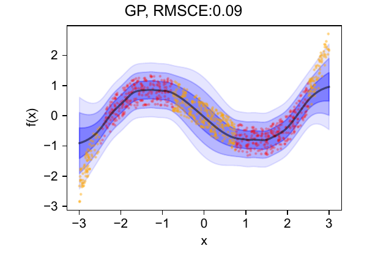
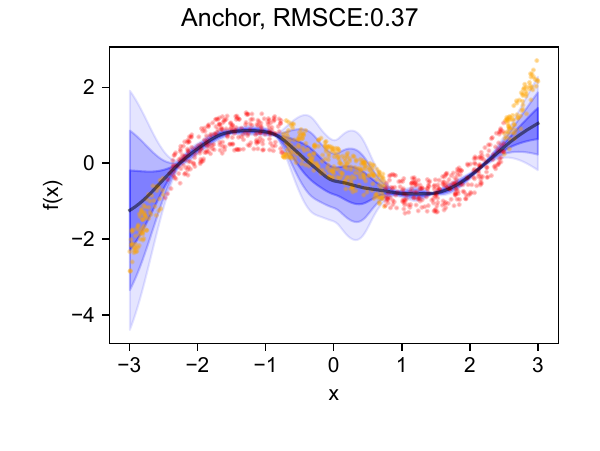
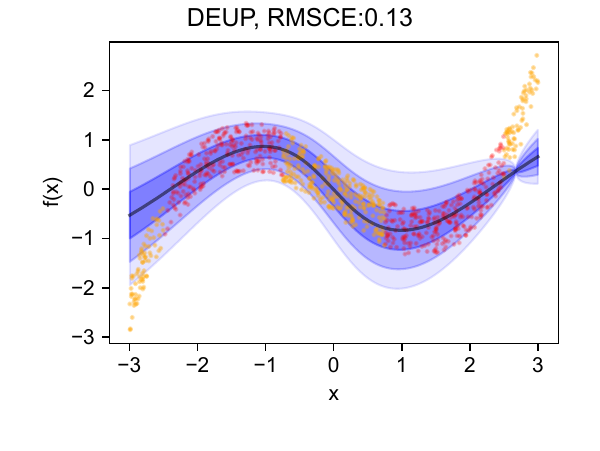

# DADEE
Repository of paper: [Direct Aleatoric and Deep Ensemble-based Epistemic (DADEE)](https://arxiv.org/abs/2407.00616)

# Results of 1D regression

Uncertainty estimation of 4 models:

  
  
  
  

